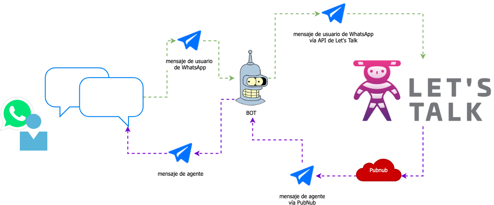

# BOT como router

Si tienes un bot que ya está respondiendo conversaciones en WhatsApp, Telegram, Facebook Messenger o similar, y necesitas derivar a un agente humano, puedes usar nuestra plataforma para resolver el problema. En este caso, tu BOT deberá actuar como router entre tus mensajes y Let's Talk.

A continuación se listan algunos casos de uso de ejemplo al respecto.

## Crear conversación en Let's Talk y enviar mensajes entre agente y usuario WhatsApp

1. BOT mantiene conversación con usuario de Whatsapp y decide derivar a un humano en Let's Talk
2. BOT se suscribe a PubNub
3. BOT crea un cliente en Let's Talk utilizando el endpoint de la API de Let's Talk [Crear/obtener un cliente](https://apidoc.ltmessenger.com/#crear-obtener-un-cliente)
4. BOT memoriza el token del cliente que obtiene del paso anterior
5. BOT inicia una conversación en Let's Talk utilizando el endpoint de la API de Let's Talk [Crear conversación](https://apidoc.ltmessenger.com/#crear-conversacion) y el token memorizado.
  - (Recomendado) En el campo mensaje concatenar todos los mensajes anteriores de la conversación del usuario de whatsapp para que el ***usuario/agente*** lea el contexto de la conversación, o bien agregar una referencia (enlace) a un lugar donde poder ver la historia de la conversación.
6. Cuando el BOT recibe mensajes del usuario WhatsApp debe enviarlos a Let's Talk utilizando el endpoint [Crear mensaje de texto plano](https://apidoc.ltmessenger.com/#crear-mensaje-de-texto-plano) o [Crear mensaje con archivo adjunto](https://apidoc.ltmessenger.com/#crear-mensaje-con-archivo-adjunto)
7. Cuando un ***usuario/agente*** escribe un mensaje en Let's Talk, el BOT recibe el mensaje a través de PubNub, según lo especificado en [Evento de creación de mensaje](https://developers.ltmessenger.com/#/bots/pubnub?id=evento-de-creaci%c3%b3n-de-mensaje), y lo envía a WhatsApp.
8. Cuando el ***usuario/agente*** cierra la conversación, el BOT recibe el evento vía Pubnub, según lo especificado en [Evento de cierre de conversación](https://developers.ltmessenger.com/#/bots/pubnub?id=evento-de-cierre-de-conversaci%c3%b3n), y actúa según lo disponga con el usuario de Whastapp

