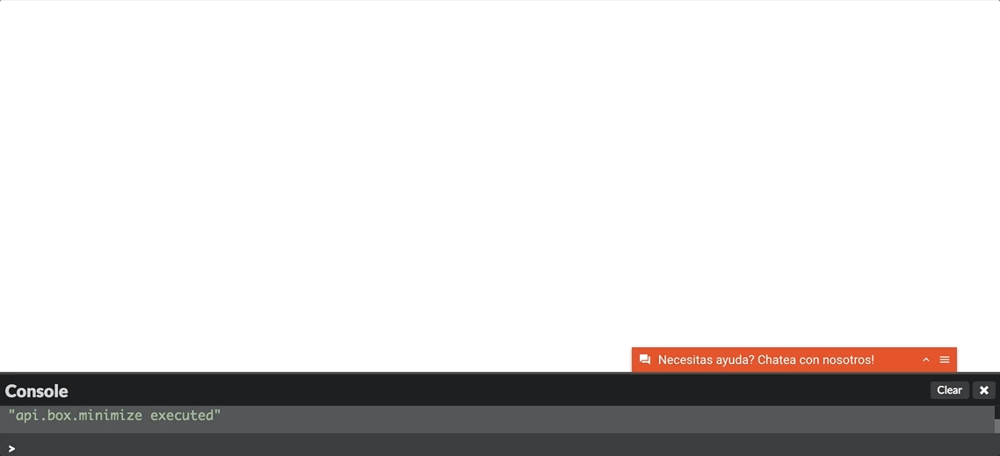
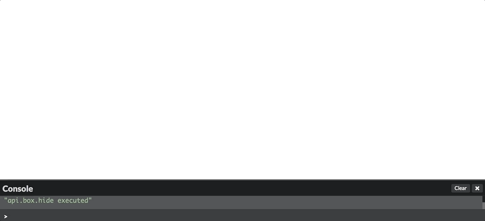
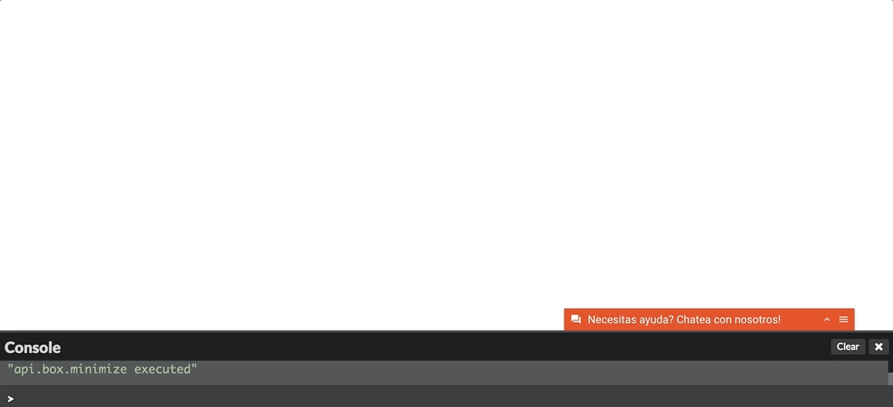

# Api Metodos Publicos

La api también permite controlar la visibilidad del chat y la escritura de mensajes internos, es decir, mensajes que son invisibles para el cliente. Esta funcionalidad es muy útil para registrar acciones relevantes automáticamente gatillados por eventos (ej: navegación, clicks, etc).

## window.$LT.setDisplayState([string])

Los valores posibles que se pueden usar son: *hidden*, *minimized*, *small*


**Hidden**

Oculta el box del chat sin destruir la sesión que tenga abierta.

*Ejemplo:*
```javascript
  window.$LT.setDisplayState('hidden');
```



**Minimized**

Pone box del chat en estado minimizado, esto es cerrado pero visible.

*Ejemplo:*
```javascript
  window.$LT.setDisplayState('minimized');
```



**Small**

Pone box del chat en estado expandido, esto es abierto y visible.

*Ejemplo:*
```javascript
  window.$LT.setDisplayState('small');
```



## window.$LT.addChatMetaData([object], bool)
Una vez que el chat está instalado y activo en la web se le puede enviar metadata que será agregada a la conversación en curso o bien a una futura que se pudiera iniciar en la sesión. Esta metadata puede ser una serie de valores definidos como par `clave: valor`. Estos valores quedarán disponibles en los reportes de las conversaciones. Además esta función acepta un segundo argumento booleano que indica si la adición de la metadata debe ser registtrada como mensaje interno en la conversación para informar al agente; con `true` se agrega el mensaje y con `false` se omite.

*Ejemplo:*
```javascript
  window.$LT.addChatMetaData({
    tipo_cliente: 'pago',
    nivel: 'VIP'
  }, true);
```

## window.$LT.addInternalSystemMessage([message])

Agrega un mensaje interno en la conversación (un mensaje sólo visible por el agente):

*Ejemplo:*
```javascript
  window.$LT.addInternalSystemMessage('Ejemplo mensaje interno');
```

## window.$LT.setInquiry([integer])

Define el _Inquiry_ para el contexto de creación de una conversación. Sólo será efectivo si se inicia una conversación. Es necesario conocer con anterioridad el `id` del _Inquiry_ deseado. Para limpiar el _Inquiry_ definido se puede usar el mismo método con argumento `0`.

*Ejemplo:*
```javascript
  window.$LT.setIquiry(888); // define inquiry 888 
```

## window.$LT.startConversation([initialObject])

Comienza una nueva conversación de forma programática. Recibe un objecto con los datos iniciales para iniciar una conversación.
`inquiry` (opcional): Un entero que es el id del inquiry (Solicitud) con la que queremos asociar la conversacion
`message` (opcional): Un object que tiene que tener 2 campos obligatorios: `content` y `content_type`. Lo que se complete en content sera el texto que es enviado como primer mensaje de la conversación.
`metadata` (opcional): Un object que tiene clave/valor que permite agregar metadata a la conversación.

*Ejemplo:*
```javascript
  window.$LT.startConversation({
    inquiry: 34,
    message: { 
      content: "prueba", 
      content_type: "text" 
    }, 
    metadata: { 
      vip: true, 
      golden: "yes" 
    }
  });
```

## window.$LT.logout()

Cierra la sesion del usuario que esta teniendo una conversación.

*Ejemplo:*
```javascript
  window.$LT.logout();
```

## window.$LT.isAvailable()

**Atención este método no es recomendable y será <span style="color:red">obsoleto proximamente<span>.** Para chequear si el widget esta disponible se recomienda
el usa del evento *[api.events.availabe](apievents#apieventsavailable)*.

*Ejemplo:*
```javascript
  window.$LT.isAvailable();
```
